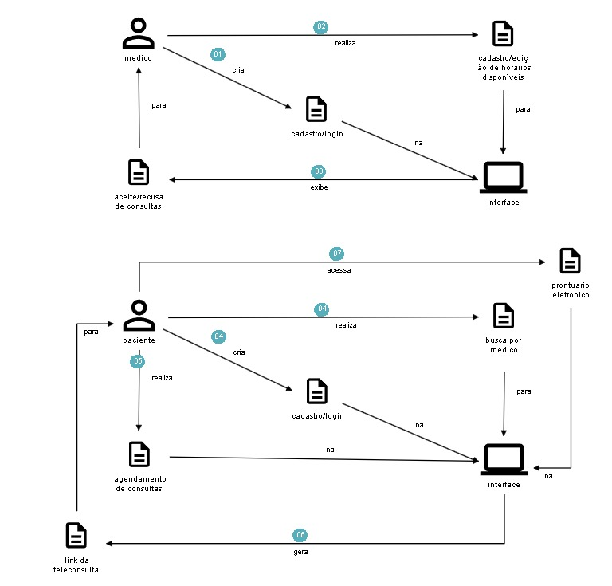

<h1 align="center">TechChallenge Fiap - Restaurante</h1>

  

## Projeto

Projeto voltado para o fluxo de consulta de medico e paciente

## Tecnologia

Este projeto foi desenvolvido utilizando as seguintes tecnologias e conceitos:

- [Java](https://www.java.com/pt-BR/)
- [Docker](https://www.docker.com/)
- [DDD (Domain-driven Design)](https://domainlanguage.com/)
- [Hexagonal Architecture](<https://en.wikipedia.org/wiki/Hexagonal_architecture_(software)>)

## Banco de dados (DER/Postgres)

  

## DDD (Domain-Driven Design)

  

### Dicionário Ubíquo

#### Medico:
- nome: O nome do medico.
- cpf: O número de CPF do medico.
- email: O endereço de e-mail do medico.
- crm: Carteira do medico.

#### Paciente:
- nome: O nome do paciente.
- cpf: O número de CPF do paciente.
- email: O endereço de e-mail do paciente.

#### Consulta
- status: O status da consulta.
- link: Link da consulta.
- duracao: Duração da consulta.

#### Agendamento
- status: O status da consulta.
- valor: o preço da consulta.

### Arquitetura 

  

### Video de explicação

https://vimeo.com/907502067

## 📝 License

This project is licensed under the MIT License. For more information, please refer to the [LICENSE](LICENSE.md) file.
